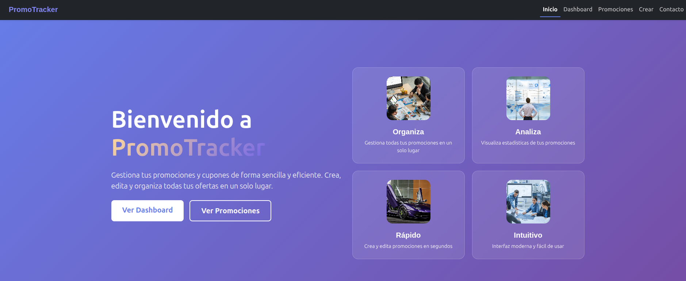
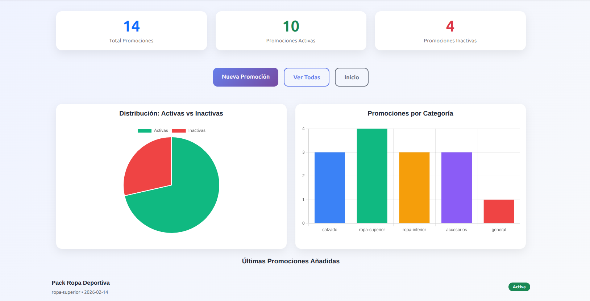
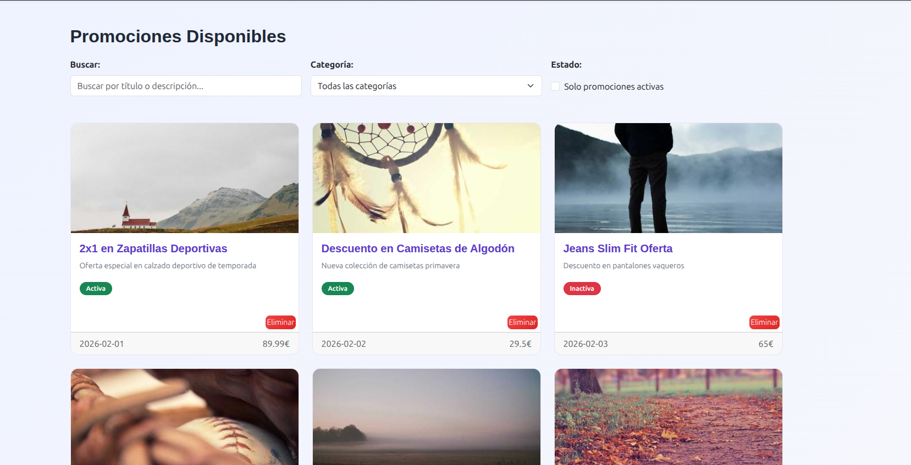
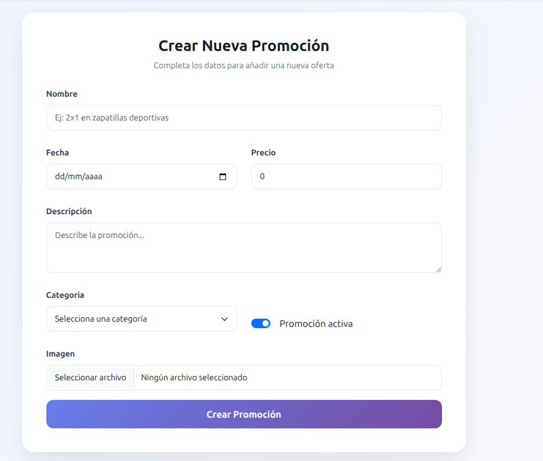
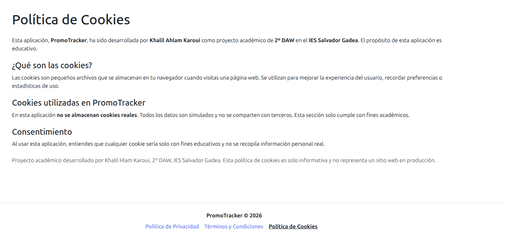
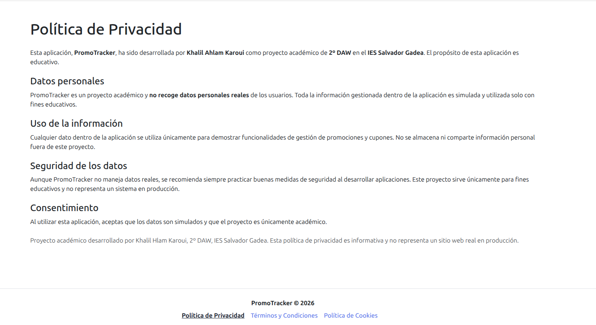
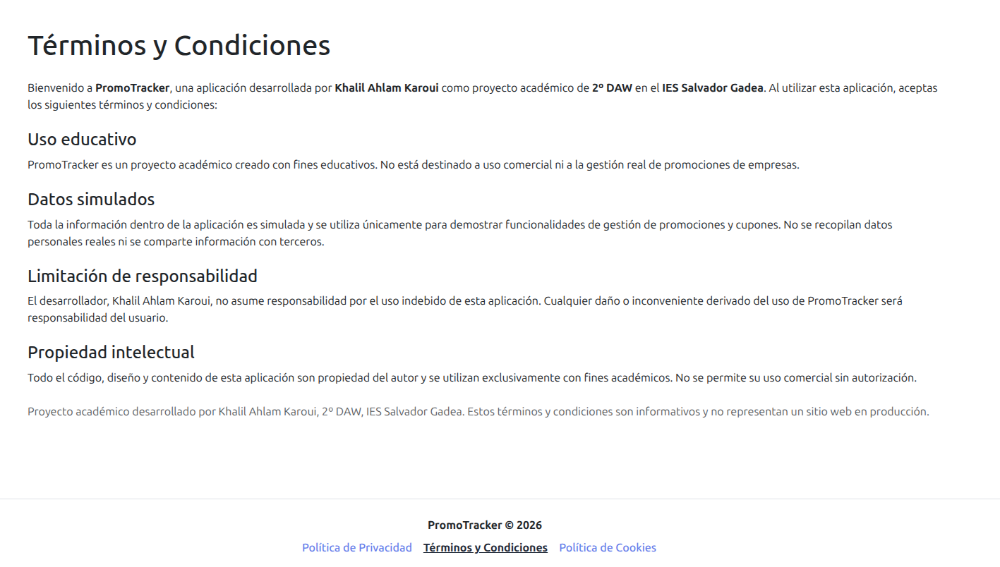

# 🚀 PromoTracker
### Panel de Gestión de Promociones

---

## 📌 Descripción

**PromoTracker** es una aplicación web desarrollada con **Angular** que simula un panel administrativo para la gestión de promociones.

Permite crear, visualizar, filtrar y analizar promociones mediante un dashboard interactivo con gráficas. El proyecto integra consumo de API simulada, filtros dinámicos, conversión de imágenes a Base64 y uso de librerías externas.

---

## 🎨 Mockups









---

## 🎯 Objetivo del Proyecto

Aplicar los conocimientos adquiridos en Angular para construir una aplicación completa que incluya:

- CRUD de promociones
- Dashboard con estadísticas dinámicas
- Filtros personalizados
- Manejo de imágenes en Base64
- Integración de librerías externas
- Consumo de API simulada con JSON Server
- Resolución de problemas reales de detección de cambios

---

## ✨ Funcionalidades Implementadas

### 🏠 Página de Inicio

Página principal de presentación del proyecto con diseño moderno y responsive.

---

### 📊 Dashboard con Gráficas

Muestra estadísticas obtenidas en tiempo real desde `db.json`:

- 🔢 Total de promociones
- ✅ Promociones activas
- ❌ Promociones inactivas
- 📊 Gráfica de barras por categoría
- 🕒 Últimas promociones añadidas

**Librerías utilizadas para las gráficas:**
- [Chart.js](https://www.chartjs.org/)
- [ng2-charts](https://valor-software.com/ng2-charts/)

Las métricas se calculan dinámicamente a partir de los datos almacenados en la API simulada.

---

### 🎟️ Lista de Promociones

Vista donde se muestran todas las promociones creadas. Incluye:

- 🔎 Filtro por búsqueda de texto (Pipe personalizado)
- 📂 Filtro por categoría mediante `<select>`
- 🔘 Filtro por estado (activas / inactivas)
- Diseño en formato cards
- Indicadores visuales de estado

> Basado en el ejercicio de Angular "Products" realizado en clase. El Pipe de búsqueda fue adaptado de una actividad anterior.

---

### ➕ Crear Promociones

Formulario completo para añadir nuevas promociones con los siguientes campos:

| Campo | Tipo |
|---|---|
| Nombre | Texto |
| Fecha | Fecha |
| Precio | Número |
| Descripción | Texto largo |
| Categoría | Select |
| Estado | Activa / Inactiva |
| Imagen | File (Base64) |

---


### 🖼️ Conversión de Imagen a Base64 y Previsualización

El navegador no permite acceder directamente a la ruta local de una imagen seleccionada desde un `input file`. Por ello, se implementó la conversión a Base64 usando `FileReader` y `ChangeDetectorRef`.
```typescript
constructor(private cdr: ChangeDetectorRef) {}

changeImage(fileInput: HTMLInputElement) {
  if (!fileInput.files || fileInput.files.length === 0) { return; }

  const reader: FileReader = new FileReader();
  reader.readAsDataURL(fileInput.files[0]);

  reader.addEventListener('loadend', () => {
    this.newPromocion.image = reader.result as string;
    this.cdr.detectChanges();
  });
}
```

La imagen convertida se guarda en `this.newPromocion.image` y se asigna al `src` de un `` para mostrar la previsualización antes de guardar.

---

### 🐞 Problema Detectado y Solución Aplicada

**Problema:** La vista no se actualizaba correctamente al crear o modificar promociones. Era necesario realizar una segunda acción para que los cambios se reflejaran.

**Causa:** El evento `loadend` del `FileReader` se ejecuta fuera del ciclo normal de detección de cambios de Angular.

**Solución:** Se forzó manualmente la detección de cambios con:
```typescript
this.cdr.detectChanges();
```

Esto garantiza que la vista se actualice inmediatamente tras cargar la imagen.

---

### 📄 Términos y Condiciones

Componente con la página de términos y condiciones de uso de la aplicación.

---

### 🔒 Política de Privacidad

Componente con la política de privacidad, informando al usuario sobre el tratamiento de sus datos.

---

### 📋 Política de Cookies

Componente con las políticas de uso de cookies de la aplicación.

---

### ❌ Error 404 - Página No Encontrada

Componente de error que se muestra automáticamente cuando el usuario introduce una ruta incorrecta o inexistente en la URL. Redirige al usuario de forma clara e informativa.

---

### 📩 Página de Contacto

Formulario de contacto funcional implementado mediante **[Formspree](https://formspree.io/)**.

Permite enviar mensajes que llegan directamente al correo del administrador, simulando un sistema de soporte en caso de incidencias.

---

### 🧭 Navbar

El navbar está basado en la documentación oficial de Bootstrap y ha sido adaptado al diseño del proyecto. Incluye:

- Versión responsive con menú hamburguesa
- Navegación entre secciones
- Personalización de estilos

---

## 🔐 Sistema de Autenticación

### Usuario de Prueba
- **Usuario:** `admin`
- **Contraseña:** `admin123`

### Funcionamiento
- **Sin login:** Solo puedes ver promociones y usar filtros
- **Con login:** Acceso completo (crear, editar, eliminar, dashboard)

### Protección
- Dashboard, Crear, Editar y Eliminar requieren login
- Los botones de gestión solo aparecen si estás logueado
- La sesión se guarda en localStorage

### Implementación
- **AuthService** verifica credenciales contra la API
- Las rutas protegidas redirigen a `/login` si no hay sesión
- El navbar muestra el usuario logueado y botón "Cerrar sesión"

> 🚧 **Beta:** Sistema con un único usuario administrador. Multi-usuario planificado para futuras versiones.

> ⚠️ **Solo educativo:** No usar en producción. Requeriría encriptación, JWT, HTTPS y backend real.


### 🗃️ API Simulada (JSON Server)

Se utiliza **JSON Server** como backend falso para simular una API REST.

**Operaciones implementadas:**

| Método | Acción |
|--------|--------|
| `GET` | Obtener promociones |
| `POST` | Crear promoción |
| `PUT` / `PATCH` | Editar promoción |
| `DELETE` | Eliminar promoción |

**Ejecutar el servidor: en local**
```bash
json-server --watch db.json --port 3000
```

---

## 🚀 Despliegue

La aplicación está desplegada y accesible en todo momento sin necesidad de tener nada abierto en local.

### 🌐 Frontend - Netlify

El proyecto Angular está desplegado en Netlify y accesible desde cualquier dispositivo.

### 🗄️ Backend - Render

La API simulada con JSON Server está desplegada en Render.

- **URL API:** `https://promotracker-api.onrender.com/promociones`

> ⚠️ **Nota:** Al usar el plan gratuito de Render, la API se "duerme" tras 15 minutos de inactividad. La primera petición puede tardar entre 30-50 segundos. Después funciona con normalidad.

### 🔗 Enlaces

- **App:** [promotracker.netlify.app](https://promotracker.netlify.app)
- **API:** [promotracker-api.onrender.com](https://promotracker-api.onrender.com)

---

## 🧱 Tecnologías Utilizadas

| Tecnología | Uso |
|---|---|
| Angular | Framework principal |
| TypeScript | Lenguaje de desarrollo |
| Bootstrap 5 | Estilos y componentes UI |
| Chart.js + ng2-charts | Gráficas del dashboard |
| JSON Server | API REST simulada |
| Formspree | Formulario de contacto |

---

## 📁 Estructura del Proyecto
```
/src
 ├── app
 │    ├── componentes
 │    │    ├── contacto
 │    │    ├── cookies
 │    │    ├── crear
 │    │    ├── dashboard
 │    │    ├── error404
 │    │    ├── footer
 │    │    ├── index
 │    │    ├── navbar
 │    │    ├── privacidad
 │    │    ├── promociones
 │    │    └── terminos
 │    ├── interfaces
 │    ├── pipes
 │    └── services
 ├── index.html
 ├── main.ts
 └── main.server.ts
db.json
```

---

## 📊 ¿Qué demuestra este proyecto?

- ✅ Consumo de API REST
- ✅ Integración de librerías externas en Angular
- ✅ Creación y uso de Pipes personalizados
- ✅ Manejo de imágenes en Base64
- ✅ Implementación de filtros dinámicos
- ✅ Construcción de dashboards con métricas reales
- ✅ Resolución de problemas del ciclo de detección de cambios
- ✅ Diseño responsive con Bootstrap
- ✅ Páginas legales como componentes (Términos, Privacidad, Cookies)
- ✅ Gestión de rutas incorrectas con página de error 404 personalizada

---

## 📌 Notas

Algunas partes del proyecto están basadas en ejercicios realizados en clase y posteriormente adaptadas:

- **Promociones List** → Basado en ejercicio *Products*
- **Pipe de búsqueda** → Adaptado de actividad anterior
- **Conversión de imagen a Base64** → Basado en actividad de *Eventos*
- **Navbar** → Basado en documentación oficial de Bootstrap

Todo el código ha sido adaptado e integrado dentro de una aplicación funcional completa.

---

## 🧪 Proyecto Académico

> Proyecto desarrollado como práctica final para aplicar conocimientos de Angular, consumo de APIs, diseño de interfaces administrativas y resolución de problemas reales en desarrollo frontend.
